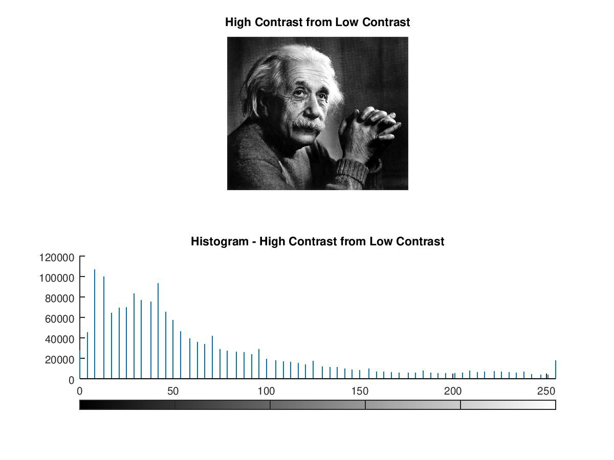
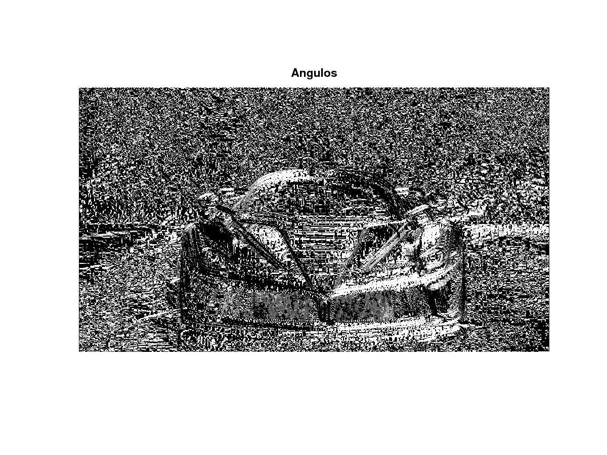
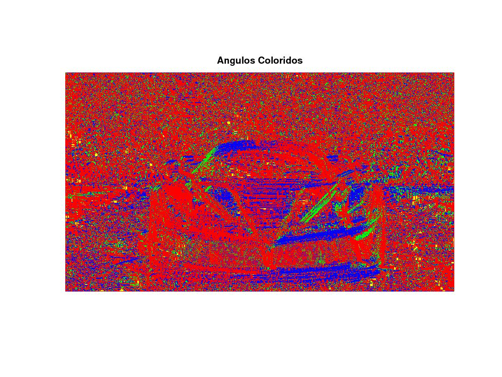
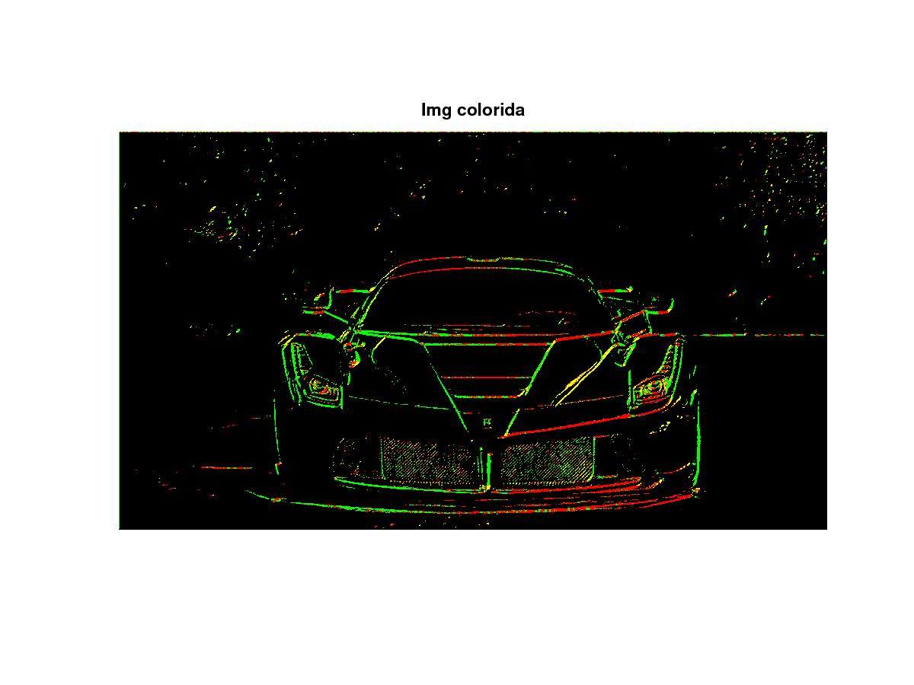
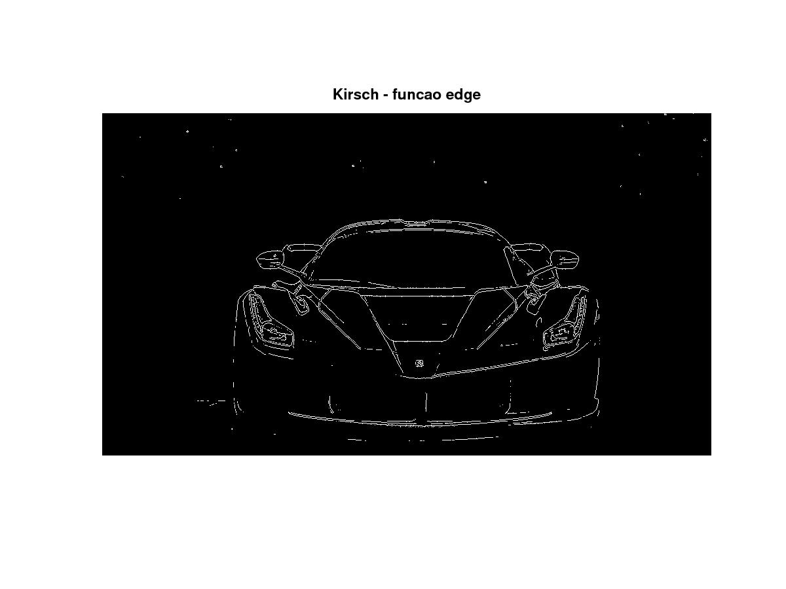
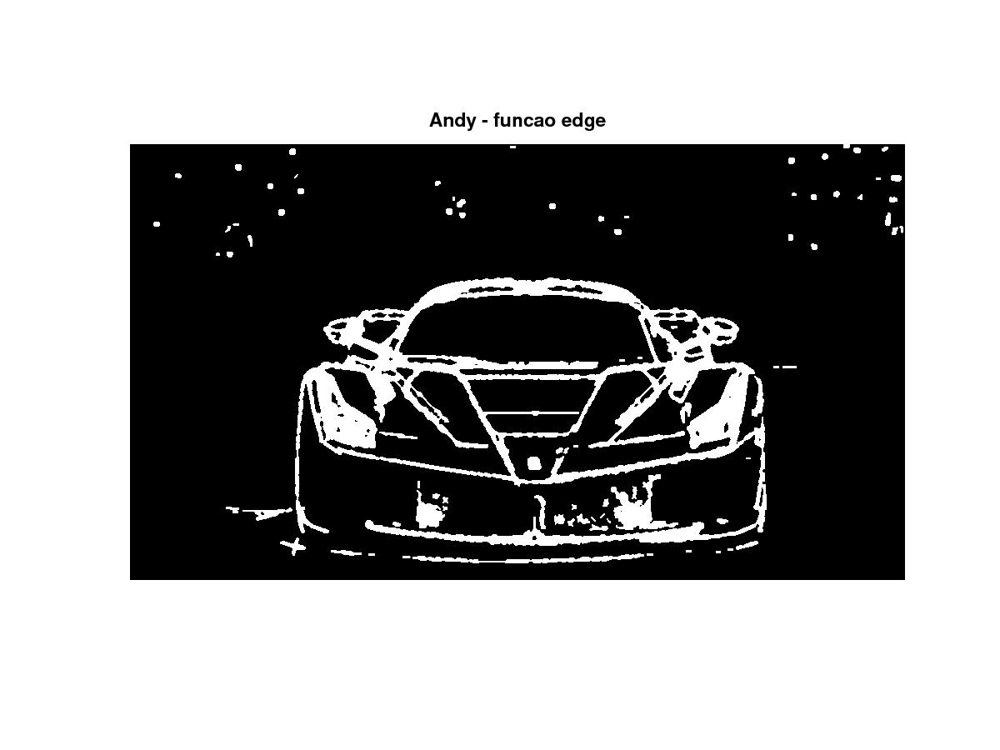

# Computação Gráfica
## Bianca Rosa de Mendonça

### Manipulação de Imagens

O código abaixo lê três imagens:

```
pkg load image;

low_contrast = imread("imagens/Einstein_low_contrast.png");
med_contrast = imread("imagens/Einstein_med_contrast.png");
high_contrast = imread("imagens/Einstein_high_contrast.png");
```


O código abaixo gera 3 imagens de histograma:

```
figure;
imhist(low_contrast);
title("Low contrast");
print -djpg geradas/histogram_einstein_low_contrast.jpg

figure;
imhist(med_contrast);
title("Medium contrast");
print -djpg geradas/histogram_einstein_medium_contrast.jpg

figure;
imhist(high_contrast);
title("High contrast");
print -djpg geradas/histogram_einstein_high_contrast.jpg
```


O código abaixo melhora o contraste da imagem:
```
hc_from_lc = imadjust(low_contrast);
figure;
subplot(2,1,1);
imshow(hc_from_lc);
title("High Contrast from Low Contrast");
subplot(2,1,2);
imhist(hc_from_lc);
title("Histogram - High Contrast from Low Contrast");
print -djpg geradas/einstein_histogram_high_contrast_from_low_contrast.jpg
```



O código abaixo clareia uma imagem e para isso, utilizamos o filtro gamma, passando 0.5 para a função imadjust.

```
pkg load image;

leme = imread("imagens/leme.bmp");
leme = im2double(leme);

figure;
subplot(2,1,1);
imshow(leme);
title("Imagem original");
subplot(2,1,2);
clearer = imadjust(leme,[],[],0.5);
imshow(clearer);
title("Partes mais escuras mais claras");
print -djpg geradas/clearer_leme.jpg
```


O código abaixo lê as imagens do Leão e da Arara e filtra utilizando o imfilter e aplicand uma suavização linear:

```
pkg load image;

img = imread("imagens/lion.png");

F = ones(5) * 1/25
I = imfilter(img, F);

figure;
subplot(2,1,1);
title("Original");
imshow(img)
subplot(2,1,2);
title("Filtrada");
imshow(I);
print -djpg geradas/lion_filtered.jpg

img = imread("imagens/arara_full.png");

I = imfilter(img, F);

figure;
subplot(2,1,1);
title("Original");
imshow(img)
subplot(2,1,2);
title("Filtrada");
imshow(I);
print -djpg geradas/arara_filtered.jpg
```


O código abaixo aplica o filtro gaussiano na imagem do Leão:

```
pkg load image;

img = imread("imagens/lion.png");

F = fspecial('gaussian', 5, 10.0);
I = imfilter(img, F);

figure;
subplot(2,1,1);
title("Original");
imshow(img)
subplot(2,1,2);
title("Filtro Gaussiano");
imshow(I);
print -djpg geradas/lion_gaussian_filtered.jpg
```


O código abaixo aplica um filtro disco na imagem da Arara:

```
pkg load image;

img = imread("imagens/arara_full.png");

F = fspecial('disk', 5, 10.0);
I = imfilter(img, F);

figure;
subplot(2,1,1);
title("Original");
imshow(img)
subplot(2,1,2);
title("Filtro Disco");
imshow(I);
print -djpg geradas/arara_disk_filtered.jpg
```


O código abaixo aplica o filtro Sobel na imagem da Ferrari:

```
pkg load image;
img = imread("imagens/Ferrari.jpg");

img = rgb2gray(img);
img = im2double(img);

sobel_horizontal = [-1 -2 -1; 0 0 0; 1 2 1];
img_sh = imfilter(img, sobel_horizontal); #Gx
figure;
title("Sobel")
subplot(2, 1, 1);
imshow(img_sh);
title("Sobel Horizontal");

sobel_vertical = [-1 0 1; -2 0 2; -1 0 1];
img_sv = imfilter(img, sobel_vertical);
subplot(2, 1, 2);
imshow(img_sv); #Gy
title("Sobel Vertical");
print -djpg geradas/segmentacao1.jpg

figure;
sobel_diag1 = [ 0 1 2; -1 0 1; -2 -1 0];
img_sa1 = imfilter(img, sobel_diag1);
subplot(2, 1, 1);
imshow(img_sa1);
title("Sobel Diagonal 1");

sobel_diag2 = [ -2 -1 0; -1 0 1; 0 1 2];
img_sa2 = imfilter(img, sobel_diag2);
subplot(2, 1, 2);
imshow(img_sa2);
title("Sobel Diagonal 2");
print -djpg geradas/segmentacao2.jpg

figure;
subplot(2, 1, 1);
shv = img_sh + img_sv;
imshow(shv);
title("Sobel Horizontal + Vertical")

filtered = shv - 0.25;
subplot(2, 1, 2);
imshow(filtered);
title("Sobel Horizontal + Vertical [Limiarizado]")
print -djpg geradas/segmentacao3.jpg

figure;
subplot(1, 1, 1);
magnitude = abs(img_sh) + abs(img_sv);
angulo = atan(img_sh ./ img_sv);
imshow(angulo);
title("Angulos")
print -djpg geradas/segmentacao5.jpg
```




Aqui, as bordas são pintadas de acordo com um ângulo:

```
angulo_ind = angulo;

angulo_ind(find(angulo < pi/3)) = 2; # verde angulo < 60
angulo_ind(find(angulo < pi/6)) = 1; # amarelo angulo < 30
angulo_ind(find(angulo < -pi/3)) = 4; # azul angulo < -60
angulo_ind(find(angulo < -pi/6)) = 3; # vermelho angulo < -30

angulo_ind(find(angulo > -pi/6)) = 1; # amarelo angulo > -30 
angulo_ind(find(angulo > -pi/3)) = 3; # vermelho angulo > -60
angulo_ind(find(angulo > pi/6)) = 2; #verde angulo > 30
angulo_ind(find(angulo > pi/3)) = 4; # azul angulo > 60

MAP = [1 1 0; 0 1 0; 1 0 0;  0 0 1];
figure;
subplot(1, 1, 1);
imshow(angulo_ind, MAP);
title("Angulos Coloridos")
print -djpg geradas/segmentacao6.jpg
```


Aplicando vários filtros:
```
shv = img_sh + img_sv;
shv(find(shv<=0.15)) = 0;
shv(find(shv>0.15)) = 1;
figure;
imshow(shv);
title("Img binaria - sobel")
print -djpg geradas/segmentacao6_1.jpg

MAP = [0 0 0; 1 1 0; 0 1 0; 1 0 0; 0 0 1];
imshow(angulo_ind .* shv, MAP);
title("Img colorida")
print -djpg geradas/segmentacao7.jpg

figure;
subplot(1, 1, 1);
edg = edge(img, "Sobel");
imshow(edg);
title("Sobel - funcao edge");
print -djpg geradas/segmentacao8.jpg

figure;
edg = edge(img, "Canny");
imshow(edg);
title("Canny - funcao edge");
print -djpg geradas/segmentacao9.jpg

figure;
edg = edge(img, "Kirsch");
imshow(edg);
title("Kirsch - funcao edge");
print -djpg geradas/segmentacao10.jpg

figure;
edg = edge(img, "Lindeberg");
imshow(edg);
title("Lindeberg - funcao edge");
print -djpg geradas/segmentacao11.jpg

figure;
edg = edge(img, "LoG");
imshow(edg);
title("LoG - funcao edge");
print -djpg geradas/segmentacao12.jpg

figure;
edg = edge(img, "Roberts");
imshow(edg);
title("Roberts - funcao edge");
print -djpg geradas/segmentacao13.jpg

figure;
edg = edge(img, "zerocross", 5, 15);
imshow(edg);
title("zerocross - funcao edge");
print -djpg geradas/segmentacao14.jpg

figure;
edg = edge(img, "Andy");
imshow(edg);
title("Andy - funcao edge");
print -djpg geradas/segmentacao15.jpg
```









O código abaixo transforma a imagem em NDVI e cria uma imagem apenas com área de vegetação e uma sem vegetação:

```
nir = imread("imagens/laranjeiras_nir.tif");
red = imread("imagens/laranjeiras_r.tif");
blue = imread("imagens/laranjeiras_b.tif");
green = imread("imagens/laranjeiras_g.tif");
nir = im2double(nir);
red = im2double(red);
blue = im2double(blue);
green = im2double(green);

out = cat(3, red, green, blue);
imshow(out);
title("Imagem colorida");
print -djpg geradas/segmentacao16.jpg

ndvi = (nir - red) ./ (nir + red);
imshow(ndvi);
title("NDVI");
print -djpg geradas/segmentacao17.jpg

vegetacao = ndvi;
vegetacao(find(vegetacao<=0.5)) = 0;
vegetacao(find(vegetacao>0.5)) = 1;
imshow(vegetacao);
title("NDVI Limiarizada - Vegetacao");
print -djpg geradas/segmentacao18.jpg

sem_vegetacao = 1-vegetacao;
imshow(sem_vegetacao);
title("NDVI Limiarizada - Areas sem Vegetacao");
print -djpg geradas/segmentacao19.jpg
```


O código abaixo separa a digital do fundo da imagem:
```
pkg load img;

digital = imread("imagens/digital.png");
imshow(digital);
digital = im2double(digital);
imhist(digital);
d = im2double(digital > 0.3);
imshow(d);
title("Digital - Separada")
print -djpg geradas/segmentacao20.jpg
```

