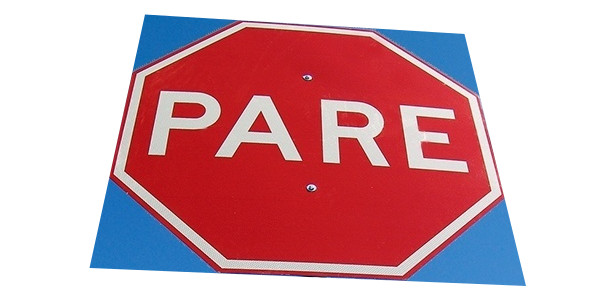

# Transformação Projetiva

Tamanho da imagem: 615x300



P1 = 145, 15 / 615-145 = 470, 300−15 = 285
```
|  470  |
|  285  |
|   1   |
```

P2 = 89, 267 / 615-89 = 526, 300−267 = 33
```
|  526  |
|  33   |
|   1   |
```


P3 = 525, 286 / 615-525 = 90, 300−33 = 267
```
|  526  |
|  33   |
|   1   |
```

P4 = 464, 34 / 615-464 = 151, 300−34 = 266
```
|  526  |
|  33   |
|   1   |
```